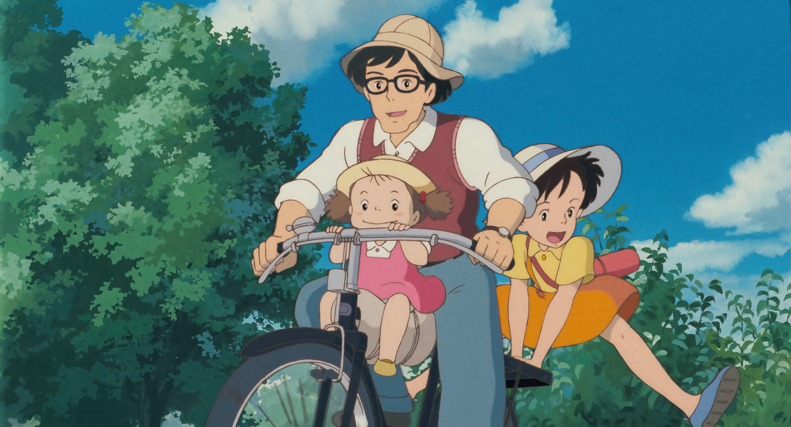
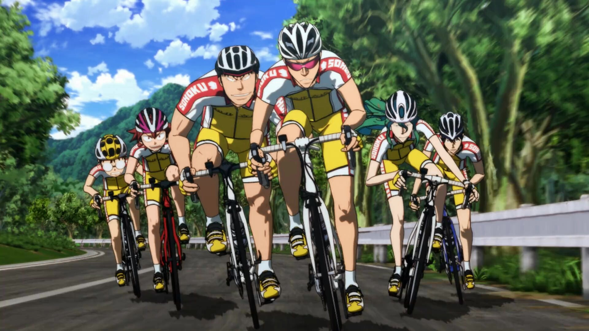

<!-- Intro -->
<h1 align="left">
  
  Konichiwa
</h1>

<!-- Banner Image -->

  

  

<!-- About Me -->
# About Me

### Yo! I’m a full stack dev who shreds bugs like singletrack. When I’m not deep in a terminal, I’m chasing sunsets on two wheels. 🌄🚵‍♂️

<!-- Cycling Image -->

  

  

---

<!-- 📊 GitHub Stats -->

  

---

<!-- Footer Quote -->

  <em>“Life is like riding a bicycle. To keep your balance, you must keep moving.” – Albert Einstein</em>

